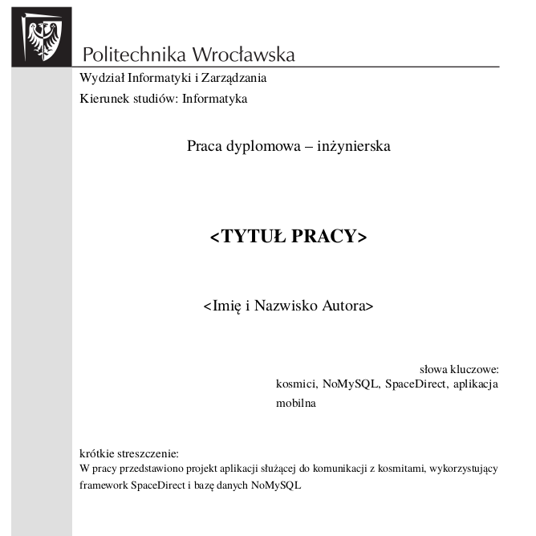

# Bachelor-Thesis-Latex-Template

Bachelor Thesis Template
Template for a BA thesis at the Faculty of Computer Science and Management of the Wroclaw University of Technology. 
Based on the template by [@WojciechThomas](https://github.com/WojciechThomas). Since this is a template for a BA 
Thesis in Polish, the rest of the description (as well as the content in .tex files) **will also be in Polish**

# Jak uruchomić?
Wystarczy sciągnąć repo i uruchomić w edytorze LaTeX-a. Przykładowo w https://overleaf.com - bezpłatnym edytorze online. 

Skompilowana wersja pdf: [praca-dyplomowa-2020.pdf](praca-dyplomowa-2020.pdf)

Plik główny: [00.tex](00.tex)

Wszystkie \usepackage oraz ustawienia dostępne do edycji w pliku [000.tex](000.tex) 

# Orginał

https://github.com/WojciechThomas/praca_inzynierska_latex
